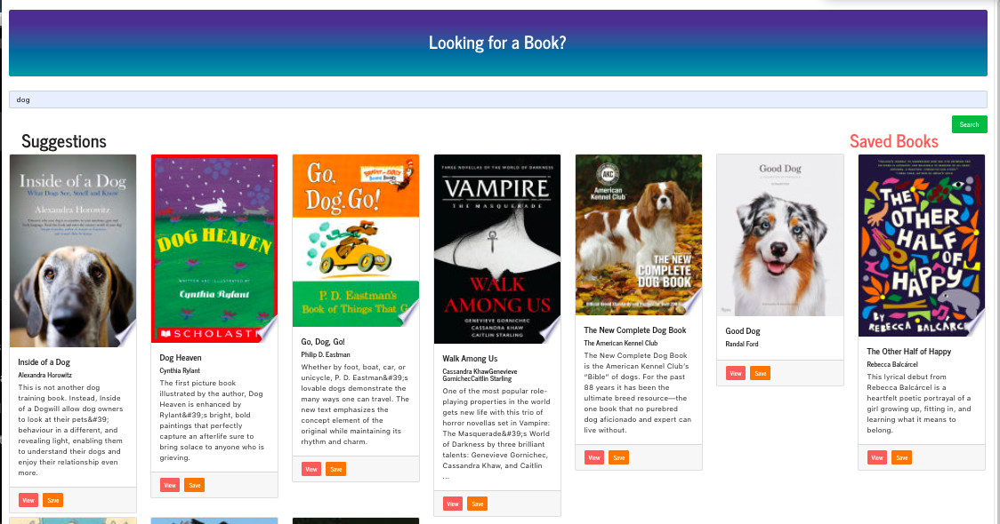

  

  # Book Search

### MERN application that allows the user to search for books using the Google Books API and saves them to a database.

#### Built with: 
  * React
  * MongoDB

## Table of Contents
  * [Installation](#installation)
  * [Usage](#usage)
  * [Contributing](#contributing)
  * [Test](#test)
  * [License](#license)
  * [Questions](#questions)

## Installation
* Clone the repo--> git clone https://github.com/khendersonPC/readme.git

* Install NPM packages--> npm install

## Usage

## Contributing
To contribute to Book Search, follow these steps:
1. Fork this repository.
2. Create a branch: "git checkout -b <branch_name>".
3. Make your changes and commit them: "git commit -m '<commit_message>"
4. Push to the original branch: "git push origin <Book Search>/<location>"
5. Create the pull request.

## Test

## License
This project is covered under a MIT license. 

## Questions
This is my [GitHub Profile](https://github.com/khendersonPC/) to check out my other repos.

Best way to reach me?
futsaldevotee@gmail.com
  
